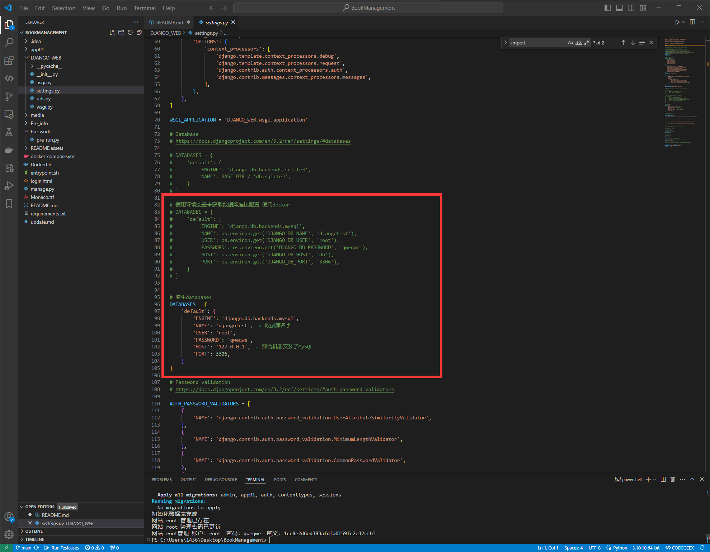
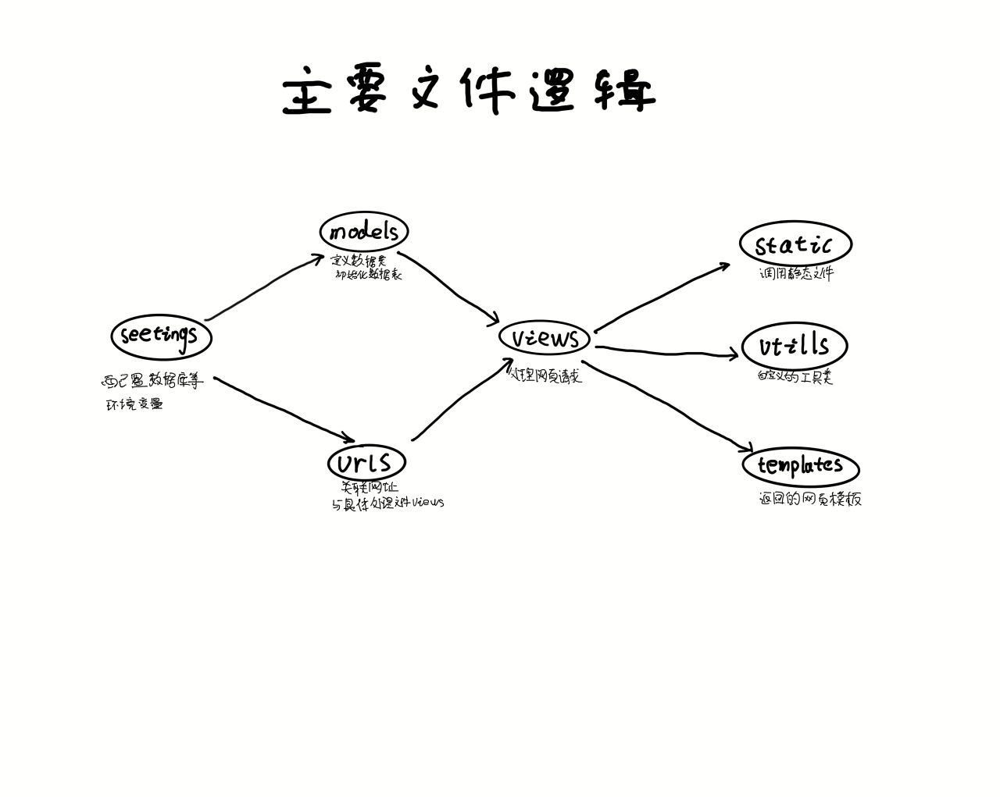
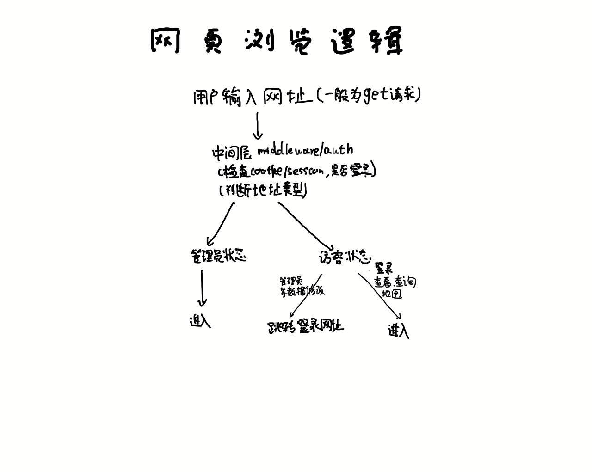
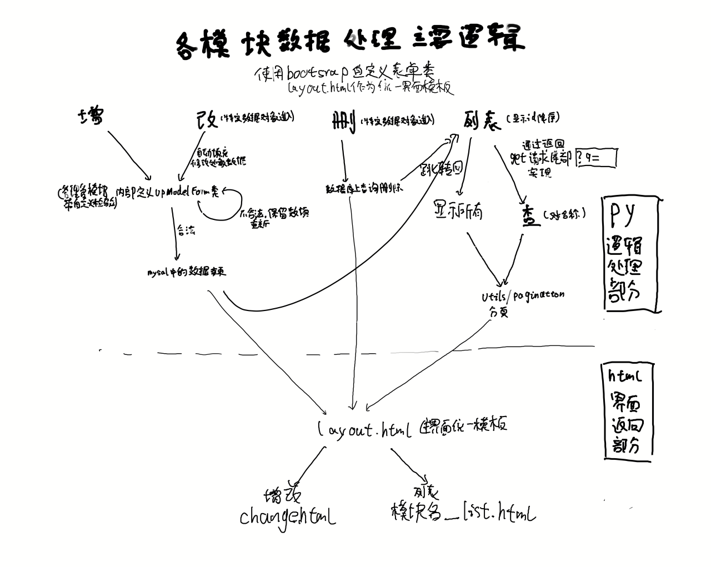
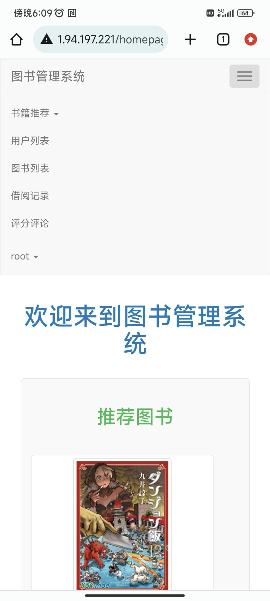

# 软件工程课程项目

[项目地址←](https://github.com/Nashi1436/SoftwareEngineeringTask_BookManagement)

[文档更新地址←](https://www.notion.so/50a2fa09b02348db912395f38777c737?pvs=21)

[预览地址](http://121.36.46.222/homepage/)[←](https://www.notion.so/PythonDjango-86cd48972fe44f9e805c8bc5c805d6be?pvs=21)[(已设置为service服务)(2024.1.22后服务器关闭)](http://121.36.46.222/homepage/)

## **项目描述**

---

基于`django` , `bootstrap3` , `html` , `css` ,  `jQuery` , `Mysql` , `orm`开发的: 

`青藏高原环境监测站数据管理系统` 

本地或服务器部署 浏览器访问使用

### **功能简述**

- 使用`mysql`数据库
- 数据增删查改功能
- 访客访问的支持，只能查看数据，修改数据跳转登录
- 数据修改采用`bootstrap3`的form表单修改功能
- `middleware`中间层auth代理，控制访客访问
- `Cookiehe`和`Session`
- 登录验证码
- 跳转主页
- 错误信息支持
- 修改数据不合法保留已输入数据
- 调用资源本地化
- 内部密码安全加密
- 对手机端适配
- 使用`django.db.models`自动数据配置
- 各个界面之间关联
- 代码内部注释
- `python脚本`自动创建数据表数据库，初始化网站root管理员
- `docker`  一键部署跨系统支持

### 待实现

- 对小窗的更好适配

## **部署|配置|访问**

---

### 前置推荐环境

```jsx
Python version  3.10.10 
Docker version 24.0.7
Docker Compose version v2.23.3-desktop.2
```

### 手动部署1

安装环境

```jsx
pip install -r requirements.txt
```

在项目根目录下运行`Pre_work/pre_run.py`脚本

自动创建数据库数据表添加网站管理员 ,具体查看调试信息和代码内注释 

修改框中数据库配置



默认网站管理员账号：`root`   密码：`qweqwe`

```jsx
python Pre_work/pre_run.py
```

成功如下：


运行

```python
python manage.py runserver
```

### 手动部署2

安装环境 JavaScript Copy Caption pip install -r requirements.txt 

```jsx
安装环境 JavaScript Copy Caption pip install -r requirements.txt 
```

手动创建数据库

修改框中数据库配置


初始化数据库

```jsx
python manage.py makemigrations
python manage.py migrate
```

数据库中手动添加网站管理员在admin表单下

（注意插入的密码为下面目录`md5`函数加密后的字符串)


运行

```python
python manage.py runserver
```

### Docker一键部署：

修改框中数据库配置


根目录下输入下面指令一键部署

```jsx
docker-compose up --build
```

### **配置**

<代补充>

### **访问**

浏览器访问对应ip端口号进入网站主页

本地访问地址 `[http://localhost:8000/](http://localhost:8000/)`

## **系统总体设计**

---

### **架构**

前端：`html` , `css` , `js` , `bootstrap3`

后端：`django` ,`python` , `xshell`

数据库：`mysql`

### 主要文件逻辑



### 网络浏览逻辑



### 各模块数据处理逻辑



### 文件树目录

```jsx
DJANGO
│  docker-compose.yml      # 用于定义和运行多容器 Docker 应用程序的 Docker Compose 配置文件
│  Dockerfile              # 构建项目 Docker 镜像的指令文件
│  entrypoint.sh           # Docker 容器启动时执行的 Shell 脚本
│  manage.py               # Django 的用于管理任务的命令行工具
│  Monaco.ttf              # 字体文件
│  README.md               # 包含项目信息的 Markdown 文件
│  requirements.txt        # 项目所需的 Python 依赖列表
│  update.md               # 关于项目更新的文档或笔记
│  
├─.idea                    # JetBrains IDE 设置的配置目录
│
├─app01                    # Django 应用目录
│  │  admin.py             # Django 管理界面的配置文件
│  │  apps.py              # Django 应用的配置文件
│  │  models.py            # 定义 Django 模型（数据库表）
│  │  tests.py             # 包含应用的测试用例
│  │  __init__.py          # 表明该目录是一个 Python 包
│  │
│  ├─middleware            # 自定义中间件组件
│  │  │  auth.py           # 认证中间件
│  │  │
│  │  └─__pycache__        # 编译后的 Python 文件，用于加速加载
│  │
│  ├─migrations            # Django 模型的数据库迁移文件
│  │  │
│  │  └─__pycache__
│  │
│  ├─static                # 静态文件目录，如 CSS、JS 和图片
│  │  ├─css                # CSS 文件
│  │  ├─img                # 图片文件
│  │  ├─js                 # JavaScript 文件
│  │  └─plugins            # 额外的插件或库
│  │
│  ├─templates             # 应用的 HTML 模板
│  │      [不同页面和组件的各种 HTML 文件]
│  │
│  ├─utils                 # 实用脚本和辅助函数
│  │  │  [各种 Python 实用工具文件]
│  │  │
│  │  └─__pycache__
│  │
│  ├─views                 # 定义应用的视图（控制4=器）
│  │  │  [不同视图功能的各种 Python 文件]
│  │  │
│  │  └─__pycache__
│  │
│  └─__pycache__
│
├─DJANGO_WEB               # 主项目目录
│  │  asgi.py              # 项目的 ASGI 配置，用于部署
│  │  settings.py          # Django 项目的主设置文件
│  │  urls.py              # Django 项目的 URL 声明
│  │  wsgi.py              # 项目的 WSGI 配置，用于部署
│  │  __init__.py          # 表明该目录是一个 Python 包
│  │
│  └─__pycache__
├─media                    # 媒体文件目录，如用户上传的文件
│
├─Pre_info                 # 额外的目录，可能用于预配置或信息
│      info.txt            # 文本文件，可能包含信息或笔记
│
└─Pre_work                 # 另一个额外的目录，可能用于准备工作
        pre_run.py         # Python 脚本，可能用于设置或初始处理
```

## **未来规划**

---

- 添加文件管理和文件播放功能
- 提高底层代码的复用性
- 添加更多其他功能

## **开发相关**

---

### **团队成员**

- 

### **角色分配**

- 

### **开发规划**

…

### **开发实践**

- 
  
    ![))1DN%(]D6LDN6C$BZ`QO6G.png](README.assets/))1DN(D6LDN6CBZQO6G.png)
    
    ```python
    注释掉重定向强进 新建的可以进去
    
    最后发现可能是不小心qweqwe打成qwe了 ，但之前调式代码里用的特判是qweqwe
    ```
    

## **联系方式**

---

邮箱：1436177712@qq.com

### **技术支持**

[提交issue](https://github.com/Nashi1436/SoftwareEngineeringTask_BookManagement/issues)

## **界面展示**

---

## 主页


### 用户登陆


### 推荐书籍


### 用户列表


### 图书列表


### 借阅记录


### 评分评论


### 新建用户


### 新建图书


### 错误信息


### 服务器端部署


### 其他设备查看




## **底层实现**

---

- 密码加密使用 根目录 [\app01\utils\encrypt.py](https://github.com/Nashi1436/PythonLessonTask_django_web/blob/main/app01/utils/encrypt.py) 下：`md5` 加密，数据库存储加密后密码

